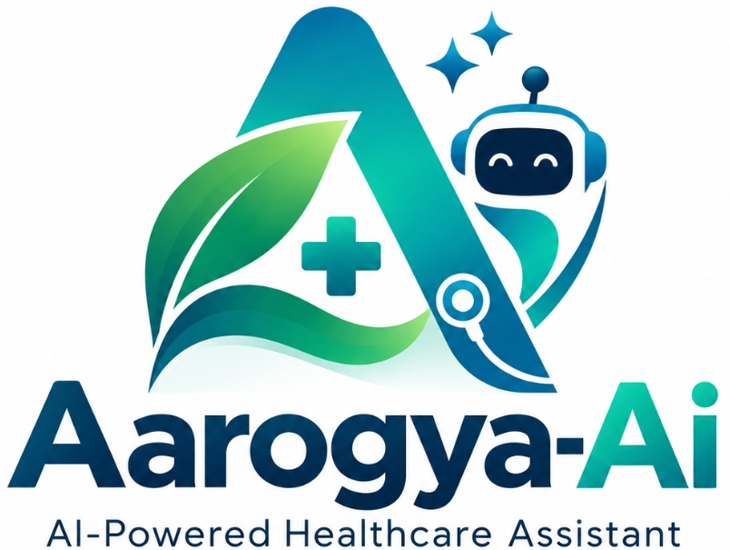

# Aarogya-Ai

<p align="center">
  
</p>

<p align="center">
  <strong>AI-Powered Healthcare Assistant</strong><br>
  <em>UNDERSTAND &bull; PREVENT &bull; LIVE BETTER</em><br>
  <strong>Your Health | Our Intelligence</strong>
</p>

An academic AI + Machine Learning healthcare web application designed to help patients understand medical prescriptions, lab reports, and health parameters in simple language while providing responsible potential disease-risk indications.

> **IMPORTANT MEDICAL DISCLAIMER:**
> This tool provides informational risk indications only and is **not a medical diagnosis**. Always consult a qualified healthcare professional before making any medical decisions.

---

## 1. Core Capabilities

1. **UNDERSTAND**: Extract medicines, lab tests, and clinical parameters from documents using OpenCV preprocessing and Tesseract OCR. Convert complex medical terminology into compassionate, patient-friendly language.
2. **VERIFY**: Empower patients with human-in-the-loop verification. Low-confidence readings are flagged, allowing users to confirm, edit, or reject values before explanations are generated.
3. **PREDICT**: Evaluate statistical potential risk indications for **Diabetes**, **Heart Disease**, and **Kidney Disease** using scikit-learn classifiers (Random Forest, Logistic Regression, Decision Tree, KNN) with verified test metrics.

---

## 2. Technology Stack

- **Frontend**: React 18, Vite, Tailwind CSS, Lucide React icons, Axios, React Router v6
- **Backend**: Python 3.10+, FastAPI, SQLAlchemy, SQLite, Pydantic v2
- **ML / Data Science**: Scikit-Learn, Pandas, NumPy, Joblib
- **Image / OCR**: OpenCV (CLAHE, Denoising, Otsu, Deskewing), Pytesseract, Pillow

---

## 3. Project Architecture

```
ai-health-companion/
├── backend/
│   ├── app/
│   │   ├── main.py                  # FastAPI application entrypoint
│   │   ├── database.py              # SQLAlchemy database models (SQLite)
│   │   ├── routes/
│   │   │   ├── upload.py            # POST /api/upload
│   │   │   ├── ocr.py               # POST /api/ocr, POST /api/verify
│   │   │   ├── explanation.py       # POST /api/explain
│   │   │   └── prediction.py        # POST /api/predict/diabetes|heart|kidney
│   │   └── services/
│   │       ├── ocr_service.py       # OpenCV preprocessing + Tesseract NLP
│   │       ├── explanation_service.py # 60+ patient-friendly term dictionary
│   │       └── prediction_service.py  # Model inference & metric retrieval
│   ├── datasets/
│   │   ├── generate_datasets.py     # Realistic synthetic clinical datasets
│   │   ├── diabetes.csv             # 768 rows, 8 features
│   │   ├── heart_disease.csv        # 303 rows, 13 features
│   │   └── kidney_disease.csv       # 400 rows, 13 features with NaN imputation
│   ├── ml/
│   │   ├── preprocessing.py         # Disease-specific scikit-learn pipelines
│   │   ├── train_models.py          # Multi-classifier training & metric generation
│   │   ├── evaluate_models.py       # Standalone test metrics inspector
│   │   └── run_training.py          # Master training execution script
│   ├── trained_models/              # Serialized .pkl models and _metrics.json
│   ├── uploads/                     # Secure local document storage
│   └── requirements.txt
├── frontend/
│   ├── src/
│   │   ├── components/              # Navbar, Footer, OCRResultPanel, ModelMetricsCard...
│   │   ├── pages/                   # HomePage, UnderstandPage, PredictPage, Dashboard, AboutPage...
│   │   ├── services/api.js          # Centralized API service
│   │   ├── App.jsx                  # Main router setup
│   │   └── index.css
│   ├── package.json
│   ├── vite.config.js
│   └── tailwind.config.js
├── start.bat                        # One-click Windows startup script
└── README.md
```

---

## 4. Setup & Running

### Prerequisites
- Python 3.10+
- Node.js 18+ (LTS)

### Option A: Using the Windows Startup Script
Double-click `start.bat` in the project root directory. It will configure the virtual environment, install dependencies, train the models if needed, and start both servers.

### Option B: Manual Setup

1. **Python Environment & Model Training:**
   ```powershell
   python -m venv venv
   .\venv\Scripts\activate
   pip install -r backend\requirements.txt
   python backend\ml\run_training.py
   ```

2. **Frontend Dependencies:**
   ```powershell
   cd frontend
   npm install
   cd ..
   ```

3. **Run Backend (Port 8000):**
   ```powershell
   .\venv\Scripts\activate
   cd backend
   uvicorn app.main:app --reload --port 8000 --host 0.0.0.0
   ```

4. **Run Frontend (Port 5173):**
   ```powershell
   cd frontend
   npm run dev -- --host 0.0.0.0
   ```

5. **Open Browser:**
   - Web App: `http://localhost:5173`
   - API Docs: `http://localhost:8000/docs`
